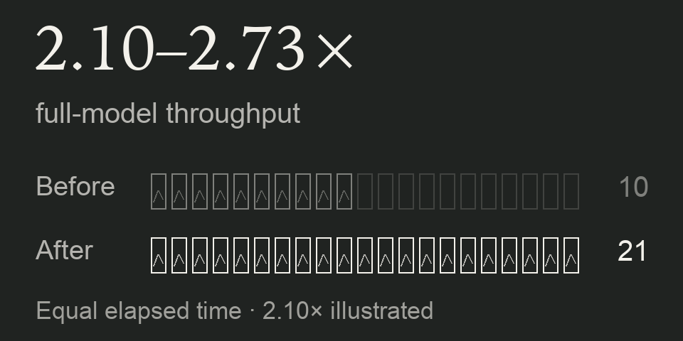
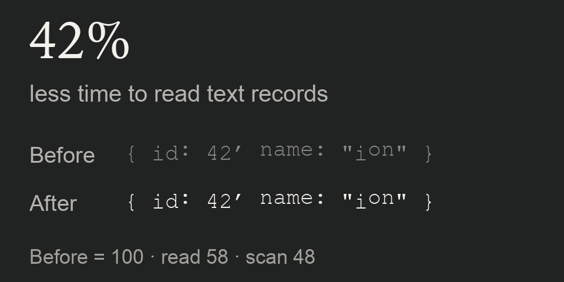
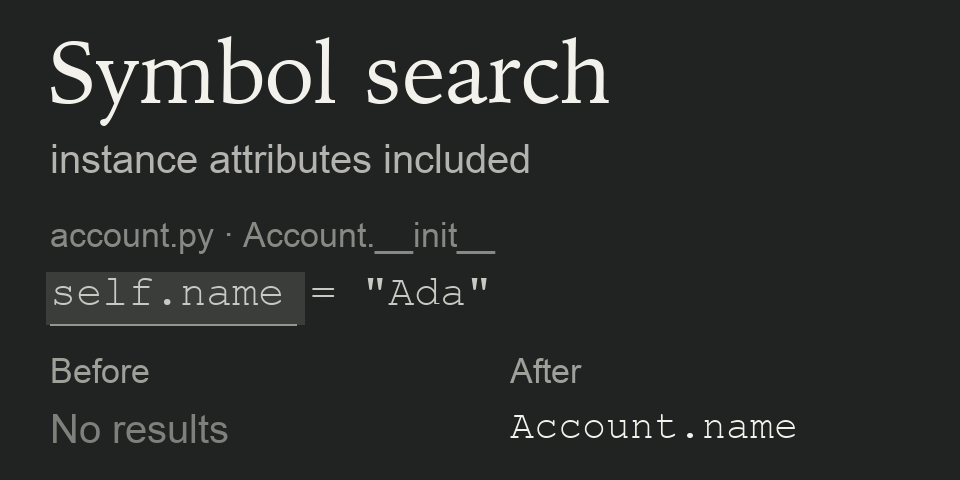
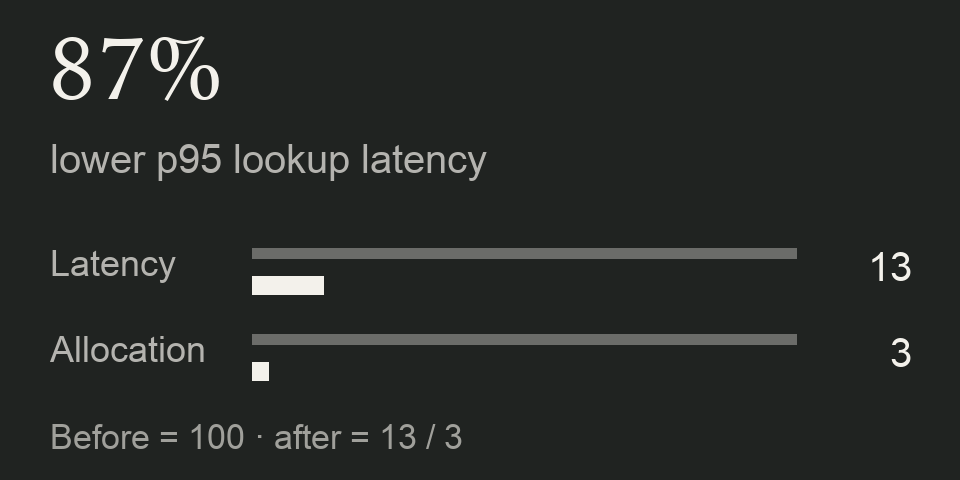

## Open-source contributions

**Netflix · VMAF**

<a href="https://www.dantrapp.com/#open-source">
  <picture>
    <source media="(prefers-reduced-motion: reduce)" srcset="assets/contributions/vmaf.png">
    
  </picture>
</a>

Optimized video-quality computation in C with ARM NEON kernels and reduced redundant filtering. Three merged PRs delivered **2.10–2.73× full-model throughput** for VMAF v1.0.16 3d0h on repeated 1080p content across 1–8 threads. **24,443 feature and score comparisons matched exactly** across the PR validation runs.

Merged PRs: [#1653](https://github.com/Netflix/vmaf/pull/1653) · [#1656](https://github.com/Netflix/vmaf/pull/1656) · [#1664](https://github.com/Netflix/vmaf/pull/1664)

[Benchmark results](benchmarks/vmaf-2026-10-05/results.json) · [Reproduction](benchmarks/vmaf-2026-10-05/benchmark.py)

**Amazon · Ion**

<a href="https://www.dantrapp.com/#open-source">
  <picture>
    <source media="(prefers-reduced-motion: reduce)" srcset="assets/contributions/ion.png">
    
  </picture>
</a>

Optimized Rust text parsing for whitespace, identifiers, and field names. Reduced **full-read time by 42%** and **scan time by 52%** on synthetic Ion 1.0 text-record benchmarks, with differential checks against the original parser.

[Merged PR #1061](https://github.com/amazon-ion/ion-rust/pull/1061) · [Benchmarks and reproduction](https://github.com/dantrapp/ion-rust/tree/933a5a0176bf4466478b61a604752df35b888543/benchmark-results/text-parser)

**Meta · Pyrefly**

<a href="https://www.dantrapp.com/#open-source">
  <picture>
    <source media="(prefers-reduced-motion: reduce)" srcset="assets/contributions/pyrefly.png">
    
  </picture>
</a>

Fixed workspace symbol search to include instance attributes defined inside methods, with regression tests. Landed in `main` through Meta's code-sync process.

[Pull request #4897](https://github.com/facebook/pyrefly/pull/4897) · [Accepted commit](https://github.com/facebook/pyrefly/commit/4bd953d9adcbaf7e6610d415078848a5fbdfd739)

### Other contributions

**AuthZed · SpiceDB**

<a href="https://www.dantrapp.com/#open-source">
  <picture>
    <source media="(prefers-reduced-motion: reduce)" srcset="assets/contributions/spicedb.png">
    
  </picture>
</a>

Replaced quadratic exclusion-list construction with linear work in Go. Reduced **p95 lookup latency by 87%** and **server allocation per lookup by 97%** in a PostgreSQL-backed benchmark with 5,000 wildcard exclusions and concurrent writes on synthetic graphs.

[Merged PR #3395](https://github.com/authzed/spicedb/pull/3395) · [Benchmarks and reproduction](https://github.com/dantrapp/spicedb/tree/5c887488c5aae616a22204541b96a28487617e9d/benchmark-results/wildcard-lookup)

Performance figures are from local Apple M4 benchmarks on the linked workloads; results vary by workload and hardware.
